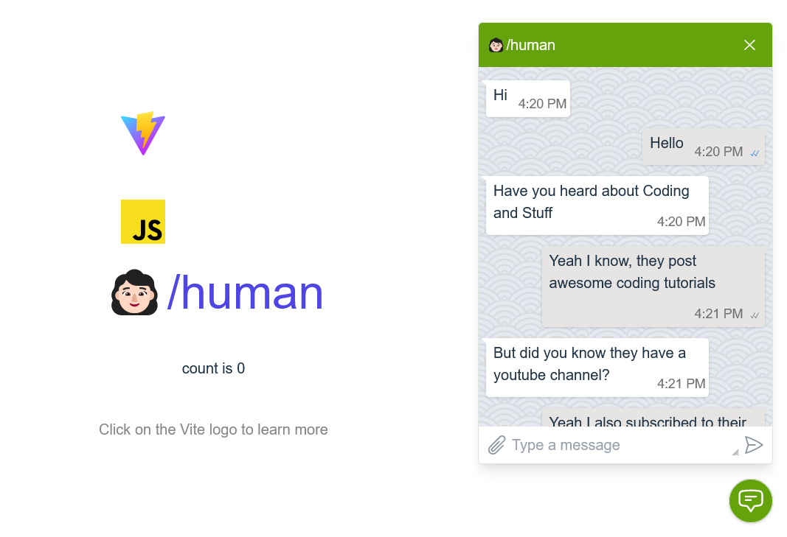

# 👩🏻/human is a static tailwind based livechat UI

As opposed to **bot**, **/human** is going to provide more "humanistic" user experience

# Preview

# Build

`npm i && npm run dev`

# TODO

- ✅responsive dialog sizing/placement
- ✅scroll snap
- dark/light theme
- custom variables
- open/close animation, hover animation
- button handlers
- aria attributes for controls
- virtual scrolling
- remember input height
- sticky dates
